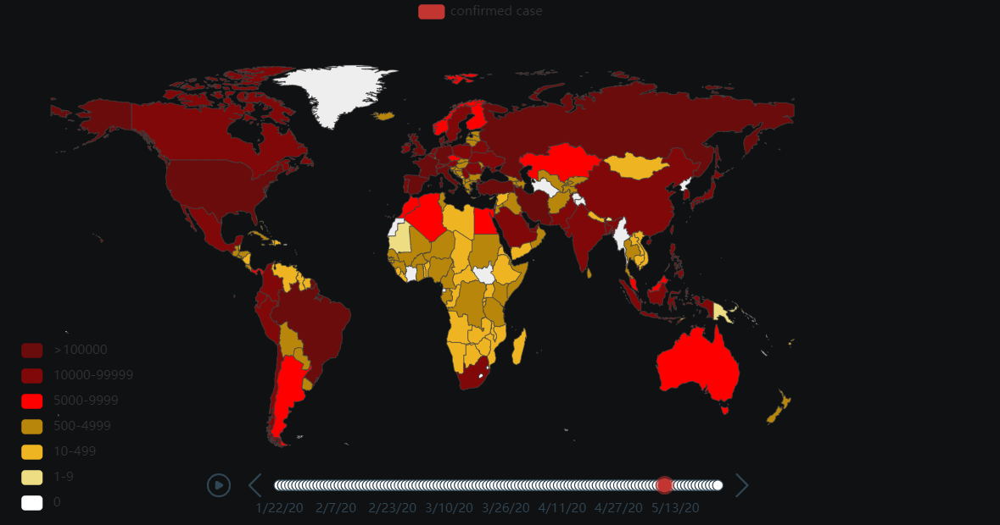
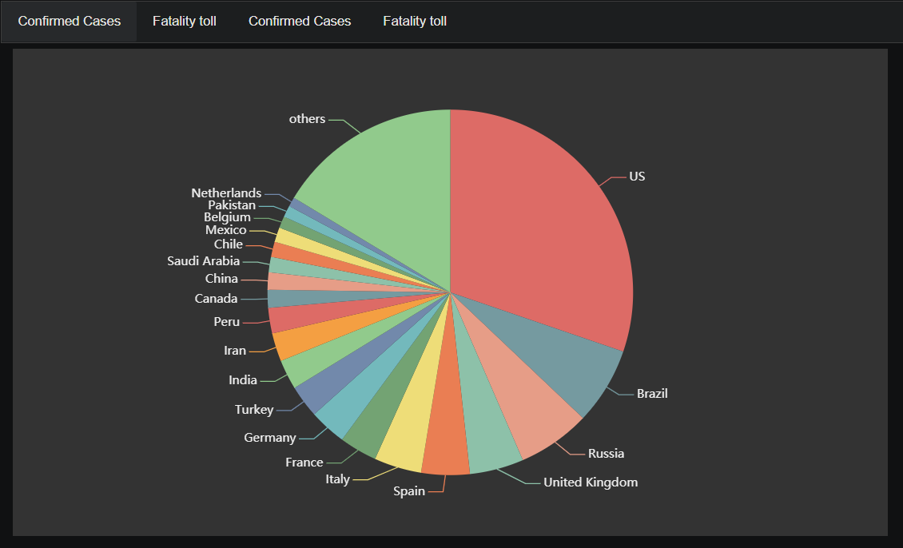

# Covid-19 data visualization wity pyecharts

## Data source
data/china_*csv: from wikipedia  
data/world_*cvs: from https://github.com/CSSEGISandData/COVID-19

## screenshot of some outputs

### timeline graph

### distribution graph

